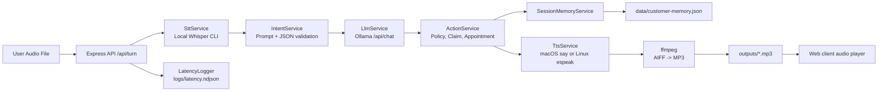
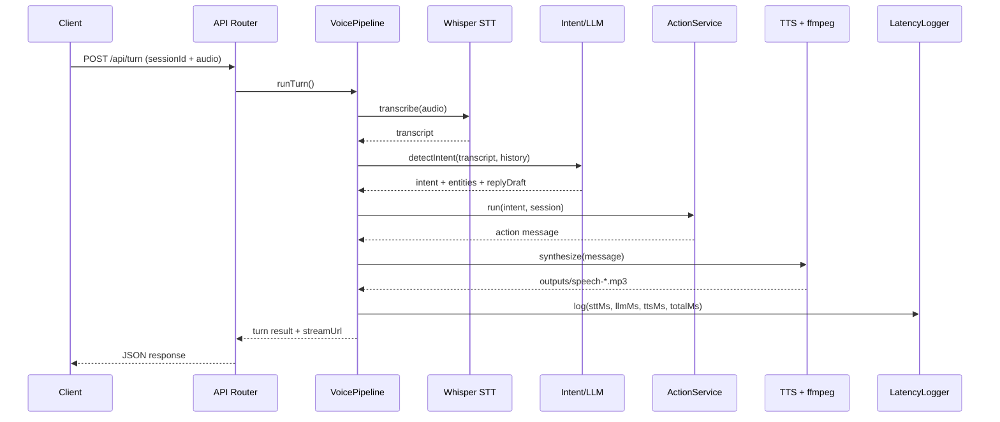

# AI Voice Agent (TypeScript, Apple Silicon)

End-to-end insurance support voice agent for three core intents:
- policy status enquiry
- claim reporting
- appointment scheduling or cancellation

The runtime pipeline is:

audio input -> Whisper STT -> Ollama LLM intent/action -> say/espeak TTS -> ffmpeg MP3 output -> browser playback

## Architecture

### Component diagram



### Turn sequence



## Requirements

- Apple Silicon Mac (M-series)
- Node.js 20+
- Python 3.10+ with `pipx`
- Whisper CLI installed as `whisper`
- ffmpeg available as `ffmpeg`
- macOS `say` command (native) or Linux `espeak`
- Ollama API URL and key

## Apple Silicon proof

Captured in this implementation environment:

```bash
$ uname -m
arm64

$ sw_vers
ProductName:    macOS
ProductVersion: 26.2
BuildVersion:   25C56

$ node -v
v24.5.0
```

## Setup

1. Install Node dependencies.

```bash
npm install
```

2. Install runtime tools.

```bash
brew install ffmpeg pipx
pipx install openai-whisper
```

3. Create a `.env` file in the repository root.

```bash
cat > .env << 'EOF'
PORT=3000
OLLAMA_API_URL=https://ollama.com
OLLAMA_API_KEY=your_api_key_here
OLLAMA_MODEL=ministral-3:14b
WHISPER_MODEL=base
WHISPER_LANGUAGE=auto
WHISPER_BINARY=whisper
TTS_VOICE=Samantha
TTS_VOICE_DE=Anna
EOF
```

4. Start the app.

```bash
npm run dev
```

Open http://localhost:3000.

## Docker

Build and run with Docker Compose:

```bash
docker compose up --build
```

The containerized stack includes:
- Node.js runtime
- Whisper CLI (`openai-whisper`)
- ffmpeg
- `espeak` fallback for TTS on Linux

Persistent runtime directories are mounted from the host:
- `uploads/`
- `outputs/`
- `logs/`
- `data/`

To stop the container:

```bash
docker compose down
```

## API

| Method | Route | Purpose |
|---|---|---|
| POST | /api/session | Create session |
| GET | /api/session | List active sessions |
| POST | /api/turn | Process one voice turn (multipart: sessionId, audio) |
| POST | /api/session/end | Clear session context |
| GET | /api/memory/customers | Inspect persisted cross-session profiles |
| GET | /api/health | Health check |
| GET | /audio/:file | Stream generated MP3 audio |

## Cross-session memory (JSON)

Customer profiles are persisted to `data/customer-memory.json`.

Persisted fields:
- customerName
- preferredLanguage (`en` or `de`)
- turnCount
- lastIntent
- lastPolicyId
- updatedAt

Behavior:
- when a known customer name appears in a new session, the service hydrates `isReturningCustomer`
- previously stored `preferredLanguage` and `lastPolicyId` are restored into session entities
- profile data is updated after each completed turn

This file is runtime data and is ignored by Git.

## German language support

German support is enabled in three places:

- intent layer:
    - intent output now carries `responseLanguage`
    - heuristic fallback detects German language cues when model output is incomplete
- action layer:
    - policy, claim, appointment, and fallback responses have German variants
    - returning customer acknowledgement is localized
- TTS layer:
    - language-aware voice selection (`TTS_VOICE_DE` for German)
    - automatic fallback to default voice if the requested voice is unavailable

## Latency benchmarking

### Methodology

- source: `logs/latency.ndjson`
- command: `npm run latency:summary`
- metrics: `sttMs`, `llmMs`, `ttsMs`, `totalMs`
- filtering rule: entries with any zero metric are excluded from report statistics

### Current benchmark snapshot

Derived from `npm run latency:summary` on this codebase (mixed run history, including cold starts and longer audio samples):

| Metric | Min (ms) | Avg (ms) | P95 (ms) | Max (ms) |
|---|---:|---:|---:|---:|
| STT | 1940 | 3451 | 10852 | 20549 |
| LLM | 1482 | 2869 | 5108 | 6193 |
| TTS | 646 | 720 | 821 | 830 |
| Total | 4437 | 7040 | 16299 | 25043 |

Sample accounting:
- valid runtime sample size: 37
- excluded zero/invalid records: 10

## Latency logging

Per-turn latency is appended to `logs/latency.ndjson` with:
- `sttMs`
- `llmMs`
- `ttsMs`
- `totalMs`

Generate an aggregate summary:

```bash
npm run latency:summary
```

## Testing

```bash
npm run typecheck
npm test
```

## Prompt versioning

- Prompt templates: `src/prompts/`
- Version metadata: `src/storage/prompt-versions.ts`

## Limitations

- Whisper CLI installation can vary by machine.
- Business actions are simulated and not connected to insurer backends.
- Cross-session memory is file-based and not optimized for concurrent multi-instance writes.
